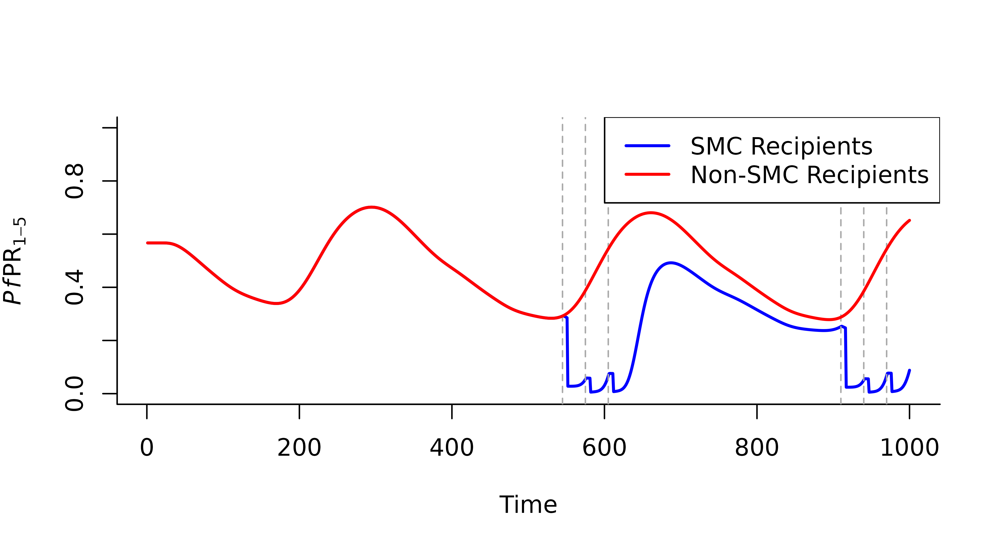

# Customising Simulation Outputs

In `malariasimple` we can customise simulation outputs in two ways:

## 1. Specifying age-specific rendering

This method is similar to the method used in `malariasimulation`.
Customisation occurs in the parameter set-up stage and the desired
output is created directly with
[`run_simulation()`](https://mrc-ide.github.io/malariasimple/reference/run_simulation.md).
However, this method is limited to specifying age categories for
prevalence and critical incidence estimates. An example of this method
to compare critical incidence in different age groups is shown in the
vignette `Basic_Model_Run`

## 2. Using get_custom_output()

One of the benefits of `malariasimple` is that comparisons between
groups of individuals can be made very easily using
[`get_custom_output()`](https://mrc-ide.github.io/malariasimple/reference/get_custom_output.md).
This method requires an extra step of post-processing after running the
simulation, however it permits much more flexibility regarding
customising the output. Any human variable can be output, this includes:

- Total humans `"n"`
- Clinical incidence `"clin_inc"`
- Detected cases `"detect"`
- Susceptibles `"S"`
- Diseased, untreaded `"D"`
- Asymptomatic infection `"I"`
- Sub-patent infection `"U"`
- Treated Disease `"T"`
- Uninfected, prophylactically protected `"P"`

We can then define the subsection of the human population we want these
outputs for. These can be defined according to three axes:

- Age
- Intervention category
- Biting group

Using this method is a two step process:

1.  Run simulation, specifying `full_output = TRUE`.
2.  Use
    [`get_custom_output()`](https://mrc-ide.github.io/malariasimple/reference/get_custom_output.md)
    to summarise the desired output variables.

Below is an example comparing malaria prevalence in children who
received SMC and those who did not.

``` r

library(malariasimple)

## Set up parameters and run simulation
#Define seasonality parameters
g0 <- 41.27
g <- c(-57.96, 14.57, 7.23)
h <- c(-35.22, 35.87, -14.93)

#Define SMC parameters
smc_days <- c(545, 575, 605, 910, 940, 970)
smc_cov <- 0.6

#Define a custom age vector
age_vector <- c(0, 0.5, 1, 2, 3, 5, 7, 10, 20, 30, 40, 50, 60, 70) * 365

#Define malariasimple parameters
smc_params <- malariasimple::get_parameters(n_days = 1000,
                             age_vector = age_vector) |>
  malariasimple::set_seasonality(g0,g,h) |>
  malariasimple::set_smc(coverages = 0.6,
          days = smc_days,
          min_age = 1 * 365,
          max_age = 5*365,
          distribution_type = "correlated") |>
  malariasimple::set_equilibrium(init_EIR = 30)

#Run simulation with 'full_output = TRUE'
smc_sim <- malariasimple::run_simulation(smc_params, full_output = TRUE) |> as.data.frame()

## Get customised outputs
#Define ages of interest (in this case, all age categories within the SMC age boundaries)
#Age categories are selected by their lower bound. Given the age_vector above
#(...1, 2, 3, 5...), selecting lower bounds 1, 2 and 3 covers the bands [1,2),
#[2,3) and [3,5) - i.e. ages 1 to 5 - which matches the SMC age range
#(min_age = 1 year, max_age = 5 years) and the reported PfPR1-5.
smc_ages <- c(1, 2, 3) * 365

#Get output for children who have received SMC
smc_kids <- get_custom_output(
  smc_params,
  smc_sim,
  output_variables = c("n", "detect"),
  ages = smc_ages,
  int_group = 3
)

#Get output for children who did not receive SMC
non_smc_kids <- get_custom_output(
  smc_params,
  smc_sim,
  output_variables = c("n", "detect"),
  ages = smc_ages,
  int_group = 1
)

## Plot the results
plot(
  smc_kids$time, smc_kids$detect / smc_kids$n,
  type = "l", col = "blue", lwd = 2,
  xlab = "Time", ylab = expression(italic(Pf)*PR[1-5]),
  ylim = c(0,1),
  bty = "l"
)
abline(v = smc_days, col = "darkgrey", lty = 2)
lines(
  non_smc_kids$time, non_smc_kids$detect / non_smc_kids$n,
  col = "red", lwd = 2
)
legend(
  "topright",
  legend = c("SMC Recipients", "Non-SMC Recipients"),
  col = c("blue", "red"), lty = 1, lwd = 2,
  bty = "c", bg = "white"
)
```


