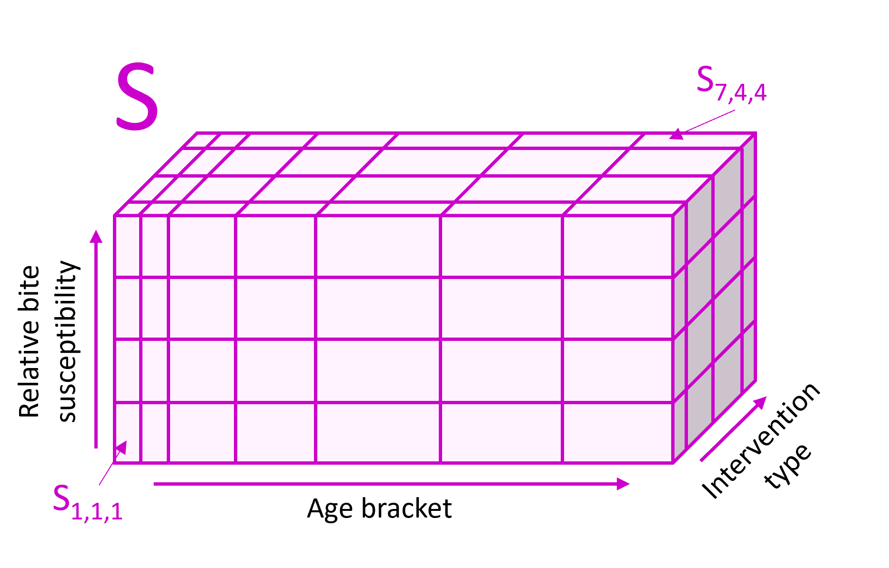
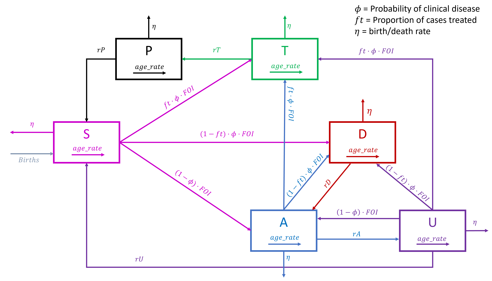

```{r, include = FALSE}
knitr::opts_chunk$set(
  collapse = TRUE,
  comment = "#>",
  dpi = 300,
  fig.width = 7
)
```
`malariasimple` is a time-discrete, compartmental approximation of the individual-based `malariasimulation` model. This vignette provides a high level overview of the human model as it is most different from `malariasimulation`.  An overview of mosquito biology can be found [here](https://mrc-ide.github.io/malariasimulation/articles/Model.html). A more comprehensive overview can be found in [Griffin et al. 2010](https://journals.plos.org/plosmedicine/article?id=10.1371/journal.pmed.1000324) (especially Supplementary Information - Protocol 1).

## The Model


`malariasimple` models the target population as divided into seven compartments defined by disease status. These are:

<div style="display: flex; align-items: flex-start;"> <div style="flex: 1;">

- **S** - Susceptible
- **D** - Untreated disease
- **A** - Asymptomatic infection
- **U** - Sub-patent infection
- **T** - Treated disease
- **P** - Uninfected, prophylactically protected.

Each disease compartment is divided into many subcompartments along three axes according to:

- Age-bracket 
- Relative bite susceptibility
- Intervention type

They are not necessarily the same width.
</div> <div style="flex: 1; padding-left: 20px;">
```{r echo = FALSE, out.width = "100%", fig.cap = "*Susceptiblity sub-compartments*"}

```
</div> </div>


Within each human sub-compartment, the population is considered a homogeneous unit. Population is defined as a fraction of the total population such that the sum of all compartments across all disease states at a given timestep will always equal 1. 


**Note in intervention compartments**

The population proportion in each compartment is defined in the input parameters, and will stay constant throughout the simulation. Hence, the proportion in each intervention category does not necessarily represent the proportion receiving an intervention at any given time, but rather the population who *will* receive the intervention at some point during the simulation. In the case of SMC, treatments are only applied to compartments that are in both SMC intervention types and SMC-eligible age-brackets. Hence compartments in the SMC intervention type that are over the maximum SMC age at the first SMC administration will never receive SMC.   


## Human Transitions

##### 1. Transitions between disease states
At each timestep, some proportion of the population will move between disease states. Transitions occur between corresponding subcompartments (i.e. S<sub>111</sub> --> D<sub>111</sub>)

##### 2. Birth and Death
New births occur into the susceptible state, across sub-compartments within the youngest age group. 
`malariasimple` currently assumes an exponential population distribution and no malaria-caused deaths. As such, the death rate is equal across all compartments and sub-compartments. New births equal total deaths in each time step, hence the population remains constant. 

##### 3. Aging
The only transitions that occur within subcompartments of a disease state is the aging process. Each time step, some proportion (according to width of age-bracket) of each age-bracket (except the oldest) 'ages' into the next age-bracket. 

```{r echo = FALSE, out.width = "110%"}

```

