```{r, include = FALSE}
knitr::opts_chunk$set(
  collapse = TRUE,
  comment = "#>",
  dpi = 300,
  fig.width = 7
)
```

*malariasimple* is a time-discrete, compartmental model. This means that the model does not use ODEs, but rather approximates them using difference equations at small time-steps. In addition, all populations are modelled as compartments and not individually. These factors allow significant speed gains in the model, however they are approximations and outputs can deviate from more mathematically exact solutions. *malariasimple* contains several tuneable parameters which can be altered to improve model speed (often at the expense of mathematical accuracy) and vice versa depending on the requirements of the user. Tuneable parameters are:

- tsd (time steps per day)
- het_brackets (Number of biting heterogeneity compartments)
- lag_rates (sub-compartments approximating the delay in FOI)
- age_vector (No. of age compartments)

Some parameter trade-offs are more efficient than others. In this vignette, we will demonstrate some recommended parameter combinations. 

**TL;DR**

- For most use cases, the default values are fine
- Optimising the age_vector is less obvious. In general, you want to increase resolution within age-ranges of interest, but avoid having too much difference in category widths
- If in doubt, check against *malariasimulation*. 

## Non-age trade-offs
To compare the efficiency of non-age_vector parameter values, we ran each combination of parameter values from:

- tsd 2:7
- het_brackets 1:7
- lag_rates 1:10

Accuracy is measured as root mean squared error (RMSE) from the average of two equivalent *malariasimulation* runs with population = 5,000,000. Runtime is the average of 10 identical *malariasimple* simulations. The example simulation included both ITN and SMC, and was run for 1000 days. 

```{r echo = FALSE, out.width = "110%"}
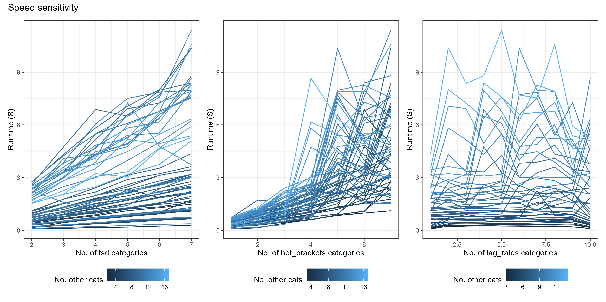
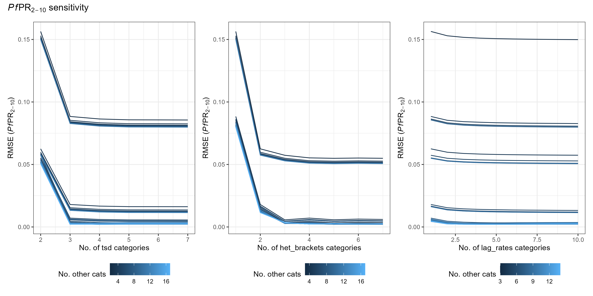
```
*Some takeaways*

- lag_rates make a small difference to accuracy, but are very cheap - so you may as well have 10
- Accuracy increases significantly for both tsd and het_brackets up to 3. After that, returns are minimal. 

#### Pareto Optimal Combinations
Speed/Accuracy for each parameter combination is plotted below. Pareto optimal solutions are shown in red. Specific parameter combinations are given in the format [tsd, het_brackets, lag_rates].


```{r echo = FALSE, out.width = "110%"}
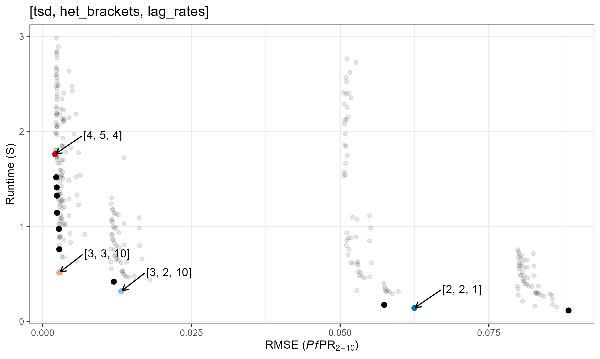
```

For reference, this is what these RMSEs look like 
```{r echo = FALSE, out.width = "110%"}
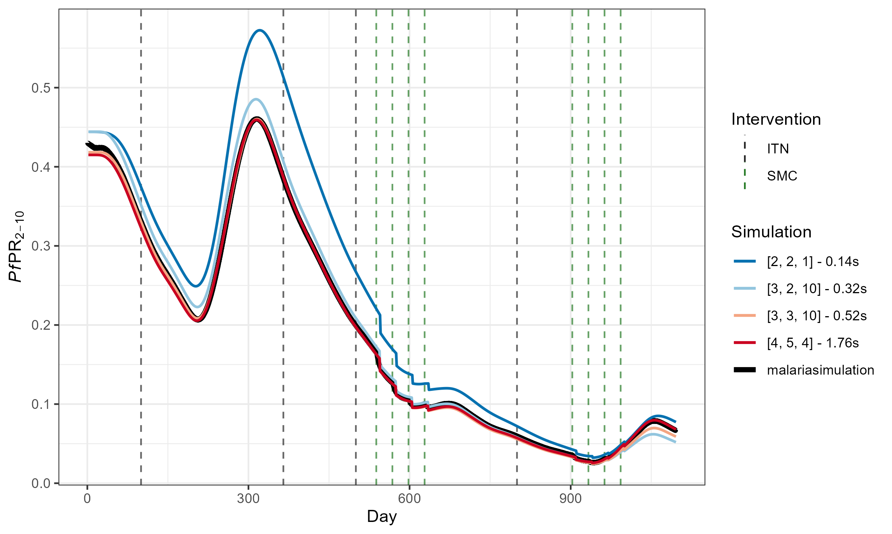
```
(The above simulations used [ages_under_2, ages_2_10, ages_over_10] = [2, 6, 4])

## age_vector trade-offs
The age_vector parameter details how many age categories the human population is divided into, as well as the size of each category. Optimising this parameter is slightly more complex and depends on depends on what you are trying to fit to. 

As a general rule, there is an added trade-off between:

- Maximising the number of age groups within the output age-range you are interested in
- Minimising differences in the age group sizes. 

In this example define age factor by 

- number of ages categories under 2 (ages_under_2)
- number of age categories between 2 and 10 (ages_2_10)
- number of age categories between 10 and 100 (ages_over_10)

using the following function
```{r eval = FALSE}
get_age_vector <- function(ages_under_2 = 3,
                           ages_2_10 = 5,
                           ages_over_10 = 10){
  ages1 <- seq(0, 2 * 365, length.out = ages_under_2 + 1)
  ages2 <- seq(2 * 365, 10 * 365, length.out = ages_2_10 + 1)
  ages3 <- seq(10 * 365, 100 * 365, length.out = ages_over_10 + 1)
  age_vector <- c(ages1[1:ages_under_2], ages2[1:ages_2_10], ages3[1:ages_over_10])
  return(age_vector)
}
```

```{r echo = FALSE, out.width = "110%"}
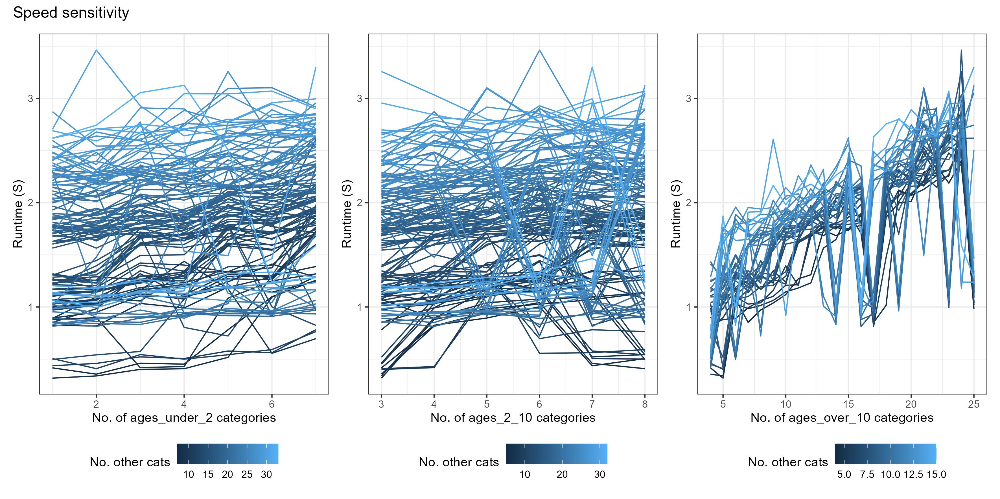
```
```{r echo = FALSE, out.width = "110%"}
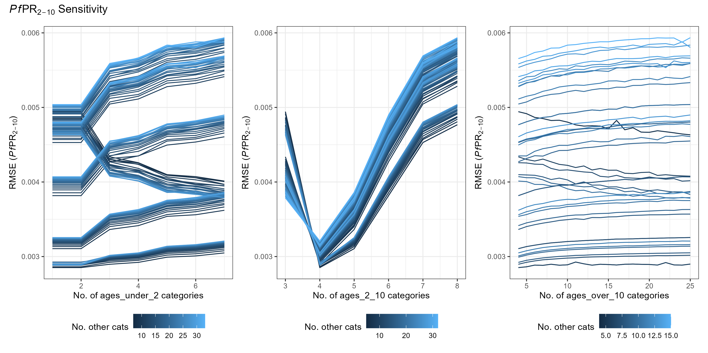
```
```{r echo = FALSE, out.width = "110%"}
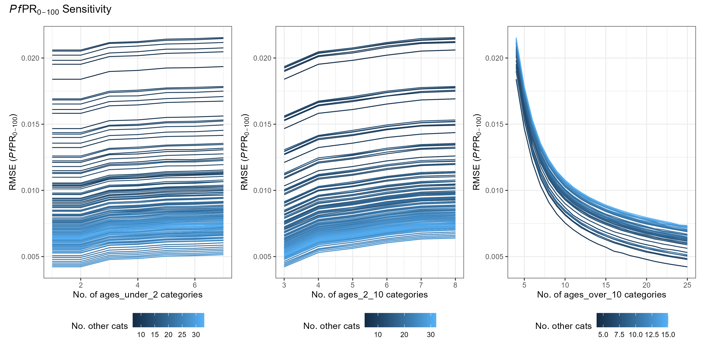
```


```{r echo = FALSE, out.width = "110%"}
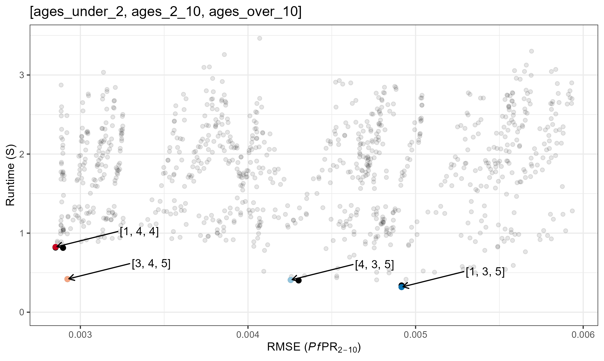
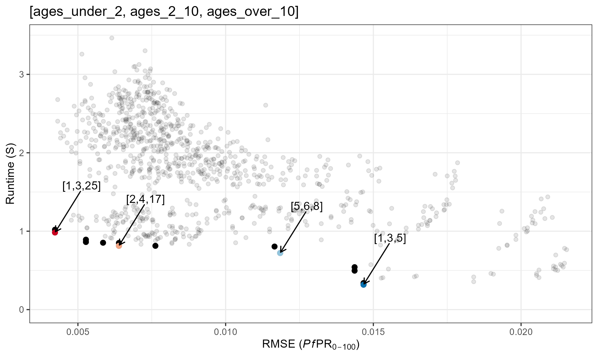
```

```{r echo = FALSE, out.width = "110%"}
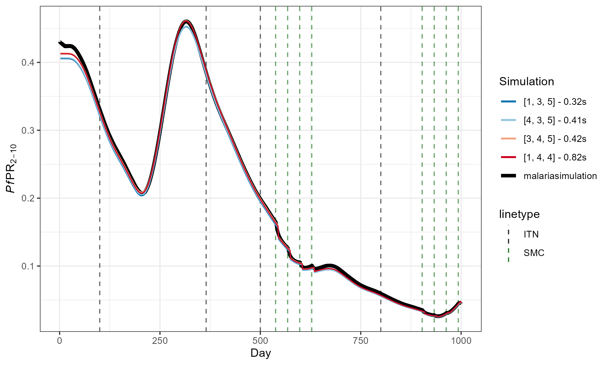
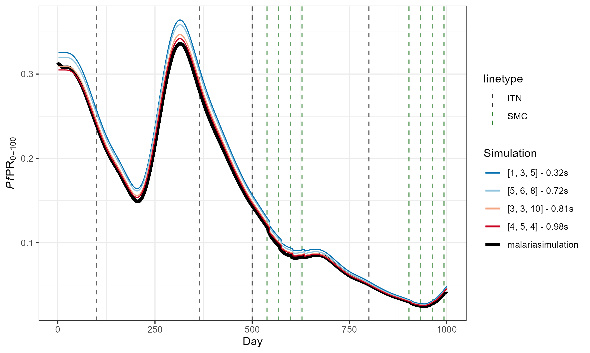
```
(The above simulations used [tsd, het_brackets, lag_rates] = [3, 4, 4])
