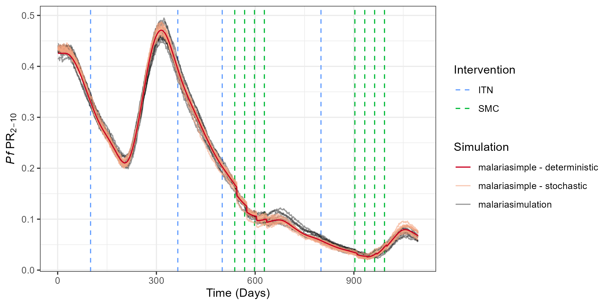

```{r, include = FALSE}
knitr::opts_chunk$set(
  collapse = TRUE,
  comment = "#>"
)
```

`malariasimple` is designed to resemble `malariasimulation` as closely as possible. However, there are certain scenarios (e.g. fast, low resolution runs; low population/transmission scenarios) where `malariasimple` may not provide a useful approximation. If in doubt, it is a good idea to check your `malariasimple` simulation against an equivalent `malariasimulation` run. In this vignette we will demonstrate some examples of comparing equivalent simulations of `malariasimulation` with both deterministic and stochastic runs of `malariasimple`.

Note: `malariasimple` is designed to be familiar to users of `malariasimulation` and hence many functions have the same name. Hence, when both libraries are loaded in an R session simultaneously, it becomes necessary to state which version of a function you are calling by using the :: operator. 

```{r, eval = FALSE}
library(malariasimple)
library(malariasimulation)
library(ggplot2)
set.seed(101)
```

## Example 1 - Good Agreement

#### Set up parameters
```{r, eval = FALSE}
n_years <- 3
human_pop <- 10000
n_days <- n_years*365
init_EIR <- 10
num_sims <- 10 #Number of parallel stochastic simulations
fine_age_vector <- c(seq(0,10,by=0.25), 15, 20, seq(30,90, by = 10)) * 365
season_params <- list(g0 = 0.28,
                      g = c(-0.3, -0.03, 0.17),
                      h = c(-0.35, 0.32, -0.07),
                      theta_c = 0.28)

#Define ITN parameters
itn_days <- c(100,365,500,800)
itn_cov <- c(0.1,0.4,0.5,0.1)
gamman <- 2.64*365
retention <- 5*365

#Define SMC parameters
smc_offsets <- c(-60, -30, 0, 30)
peak_cc <- get_peak_cc(season_params)
smc_days <- rep(365 * seq(1, n_years - 1, by = 1), each = length(smc_offsets)) +
  peak_cc +
  rep(smc_offsets, 2)
smc_cov <- seq(0.3,0.6, length.out = length(smc_days))
smc_min_age = 0.25*365
smc_max_age = 5*365
```

### malariasimulation
```{r, eval = FALSE}
#Set up malariasimulation parameters
n_dist <- length(itn_days)
dn0 <- rep(0.41, n_dist)
rn <- rep(0.56, n_dist)
rnm <- rep(0.24, n_dist)
gamman_vec <- rep(gamman, n_dist)

malsim_params <- malariasimulation::get_parameters(
  overrides = list(
    model_seasonality = TRUE,
    g0 = season_params$g0,
    g = season_params$g,
    h = season_params$h,
    clinical_incidence_rendering_min_ages = 0,
    clinical_incidence_rendering_max_ages = 100 * 365,
    prevalence_rendering_min_ages = 2 * 365,
    prevalence_rendering_max_ages = 10 * 365,
    human_population = human_pop
  )
) |>
  malariasimulation::set_drugs(list(SP_AQ_params)) |>
  malariasimulation::set_smc(
    drug = 1,
    timesteps = smc_days,
    coverages = smc_cov,
    min_ages = rep(smc_min_age, length(smc_days)),
    max_ages = rep(smc_max_age, length(smc_days))
  ) |>
  malariasimulation::set_bednets(
    timesteps = itn_days,
    coverages = itn_cov,
    retention = retention,
    dn0 = matrix(dn0, nrow = n_dist, ncol = 1),
    rn = matrix(rn, nrow = n_dist, ncol = 1),
    rnm = matrix(rnm, nrow = n_dist, ncol = 1),
    gamman = gamman_vec
  ) |>
  malariasimulation::set_equilibrium(init_EIR = init_EIR)

#Run malariasimulation 
malsim <- run_simulation_with_repetitions(
  timesteps = n_days,
  repetitions = num_sims,
  overrides = malsim_params,
  parallel = TRUE
)
```

### malariasimple - deterministic
```{r, eval = FALSE}
simple_det_params_1 <- malariasimple::get_parameters(
  n_days = n_days,
  prevalence_rendering_min_ages = 2 * 365,
  prevalence_rendering_max_ages = 10 * 365,
  age_vector = fine_age_vector,
  human_pop = human_pop
) |>
  malariasimple::set_seasonality(season_params = season_params) |>
  malariasimple::set_itn(
    itn_days = itn_days,
    itn_cov = itn_cov,
    gamman = gamman,
    retention = retention
  ) |>
  malariasimple::set_smc(
    smc_lower_age = smc_min_age,
    smc_upper_age = smc_max_age,
    smc_cov = smc_cov,
    smc_days = smc_days,
    distribution_type = "random"
  ) |>
  malariasimple::set_equilibrium(init_EIR = init_EIR)

simple_det_1 <- malariasimple::run_simulation(simple_det_params_1) |> as.data.frame()
```

### malariasimple - stochastic
```{r, eval = FALSE}
simple_stoch_params_1 <- malariasimple::get_parameters(
  n_days = n_days,
  prevalence_rendering_min_ages = 2 * 365,
  prevalence_rendering_max_ages = 10 * 365,
  age_vector = fine_age_vector,
  stochastic = TRUE,
  human_pop = human_pop
) |>
  malariasimple::set_seasonality(season_params = season_params) |>
  malariasimple::set_itn(
    itn_days = itn_days,
    itn_cov = itn_cov,
    gamman = gamman,
    retention = retention
  ) |>
  malariasimple::set_smc(
    smc_lower_age = smc_min_age,
    smc_upper_age = smc_max_age,
    smc_cov = smc_cov,
    smc_days = smc_days,
    distribution_type = "random"
  ) |>
  malariasimple::set_equilibrium(init_EIR = init_EIR)

simple_stoch_1 <- malariasimple::run_simulation(simple_stoch_params_1, n_particles = num_sims) |>
  make_2d()
```

### Plot
```{r, eval = FALSE}
library(ggplot2)
ggplot() +
  geom_vline(aes(xintercept = itn_days, lty="ITN"), col = "#619CFF", key_glyph = "path") +
  geom_vline(aes(xintercept = smc_days, lty="SMC"), col = "#00BA38", key_glyph = "path") +
  geom_line(data = malsim,
            aes(x=timestep, y = n_detect_lm_730_3650/n_age_730_3650,group=repetition, col = "malariasimulation"),
            alpha=0.4) +
  geom_line(data = simple_stoch_1,
            aes(x=time, y=n_detect_730_3650 / n_730_3650, col = "malariasimple - stochastic", group = particle),
            alpha=0.6) +
  geom_line(data = simple_det_1,
            aes(x=time, y=n_detect_730_3650 / n_730_3650, col = "malariasimple - deterministic")) +
  scale_color_manual(values = c("malariasimple - deterministic" = "#CA0020","malariasimple - stochastic" = "#F4A582", "malariasimulation" = "black")) +
  scale_linetype_manual(values = c(SMC = 2, ITN = 2)) +
  labs(x="Time (Days)",
       y=bquote(italic(Pf)~PR[2-10]),
       linetype = "Intervention",
       color = "Simulation") +
  theme_bw()
```

```{r echo = FALSE, out.width = "110%"}

```
